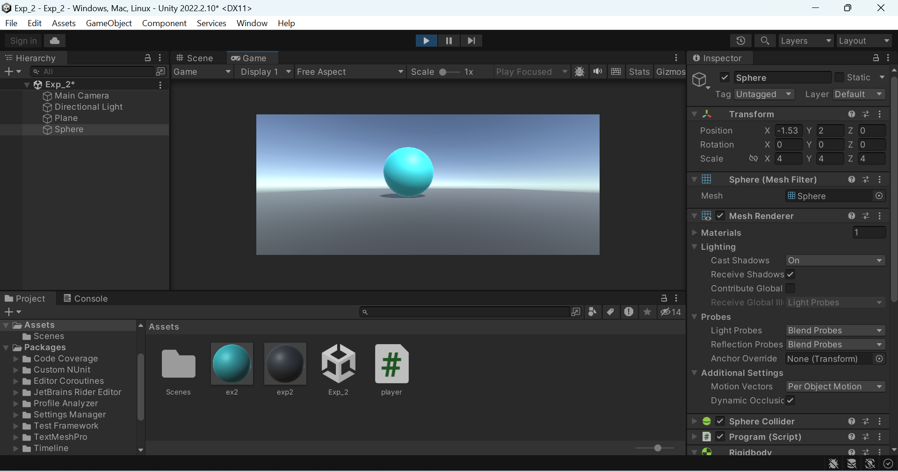
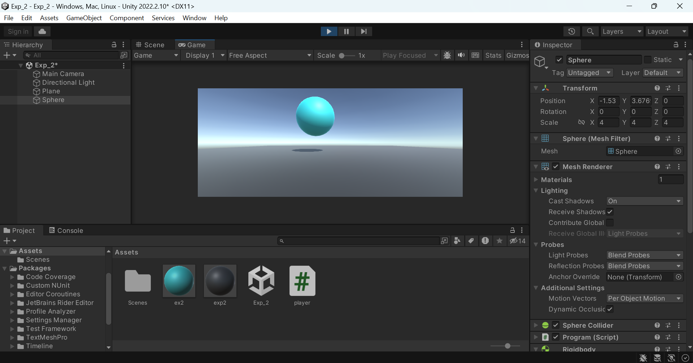

# ROLL A BALL
## AIM:
To Roll a Ball using C# program in unity.

## ALGORITHM:
1. File -> Scene -> Select the scene -> Save as-> New folder(Scenes)-> File name (Mini Game)

2. Hierarchy  -> 3D Object-> Plane 
[ Right side-> Inspector-> Change the name of plane (Name: Ground)
Transform -> Reset
Edit -> Frame Selected ]

3. Scale the ground by giving the scaling value as x=4 y=1 z=4

4. Hierarchy  -> 3D Object-> Sphere
[ Right side-> Inspector-> Change the name of plane (Name: Player)
Transform -> Reset
Edit -> Frame Selected 
Transform -> Position -> y=0.5]

5. Hierarchy -> Directiona lLight
[ Inspector -> Change the color to white (255,255,255)]

6. Create a folder in project and name as Materials
[Material folder -> Create -> Material (Name: Background)
Inspector ->Surface Inputs ->Base Map (Choose the color)
Metallic map-> 0
Smoothness -> 0.25
Drag the Background to the plane and release the mouse

Material folder -> Create -> Material (Name: Sphere)
Inspector ->Surface Inputs ->Base Map (Choose the color)
Metallic map-> 0
Smoothness -> 0.75
Drag the Sphere material to the ball and release the mouse

7. Hierarchy -> Player-> Inspector ->Add component-> Rigid body

8. Create a new script -> Create a folder in project (Name: Scripts)
Hierarchy -> Player -> Inspector-> AddComponent-> NewScripts-> PlayerController( Click create and Add)
Copy the PlayerController and drag to Script folder
Double click the PlayerController file and type the coding

## PROGRAM:
```
NAME : PAARKAVY B
REG NO : 212221230072
```

```
using System.Collections;
using System.Collections.Generic;
using UnityEngine;

public class Program : MonoBehaviour
{
    public float Xforce = 5.0f;
    public float Zforce = 5.0f;
    public float Yforce = 300f;

    // Start is called before the first frame update
    void Start()
    {

    }
    // Update is called once per frame
    void Update()
    {
        float x = 0.0f;
        float y = 0.0f;
        float z = 0.0f;
        if (Input.GetKey(KeyCode.A))
        {
            x = x - Xforce;
        }
        if (Input.GetKey(KeyCode.D))
        {
            x = x + Xforce;
        }
        if (Input.GetKey(KeyCode.W))
        {
            z = z + Zforce;
        }
        if (Input.GetKey(KeyCode.S))
        {
            z = z - Zforce;
        }
        if (Input.GetKeyDown(KeyCode.Space))
        {
            y = Yforce;
        }
        GetComponent<Rigidbody>().AddForce(x, y, z);

    }
}
```

## OUTPUT:




## RESULT:
Thus,the 3D application for Roll the Ball objects in unity is developed successfully.
